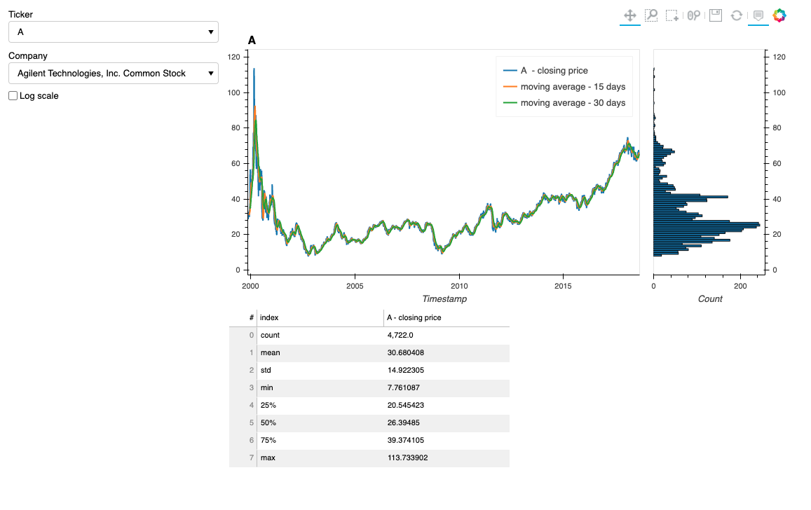

Panel Dashboard
==============================
Panel can be used to create dashboards with the pythonic interface. This library explores the option to develop time-series dashboard using the panel.

`panel_dashboard` library takes in time series data as input and creates three plots in the dashboard for the selected tag.

    1. Tag values vs timestamps
    2. Histogram of the tag values
    3. Description pane for the tag values

To understand the options available to create timeseries dashboard use the following command.

 `python3 panel_dashboard/dashboard.py --help`

```
python3 timeseries.py --help
usage: timeseries.py [-h] [-f FILENAME]
                     [-ft {csv,excel,feather,hdf,parquet,pickle}]
                     [-kwgs [READ_KWARGS [READ_KWARGS ...]]]
                     [-fa FEATURE_ALIASES] [-d DESCRIBE] [-p PORT]
                     [-s SAMPLE_RATE] [-w WEBSOCKET_ORIGIN]

Create a dashboard with a pandas readable file (csv, hdf, parquet etc.)

optional arguments:
  -h, --help            show this help message and exit
  -f FILENAME, --filename FILENAME
                        Location of file. By default, it accepts csv file that
                        should be readable as pd.read_parquet(filename). To
                        accept different type of file use the filetype and
                        read_kwargs arguments, (type: str) (default:
                        /mnt/data/final/historical_stock_prices.parquet)
  -ft {csv,excel,feather,hdf,parquet,pickle}, --filetype {csv,excel,feather,hdf,parquet,pickle}
                        Type of file that is provided at filename argument.
                        Available options can be csv, excel, feather, hdf,
                        parquet, pickle etc., (type: str) (default: parquet)
  -kwgs [READ_KWARGS [READ_KWARGS ...]], --read-kwargs [READ_KWARGS [READ_KWARGS ...]]
                        Additional keyword arguments to read the {filename}
                        using the pandas read_{filetype}. Keywords should be
                        provided in the following format -kwgs foo1=bar
                        foo2=10(type: str) (default: None)
  -fa FEATURE_ALIASES, --feature-aliases FEATURE_ALIASES
                        Path to the json file which contains dictionary object
                        with keys as column names and values as column name
                        aliases, (type: str) (default:
                        /mnt/data/final/feature_aliases.json)
  -d DESCRIBE, --describe DESCRIBE
                        Should the dashboard include
                        pandas.tag_series.describe() along with the plot,
                        (type: bool) (default: True)
  -p PORT, --port PORT  Port to launch the dashboard on, (type: int) (default:
                        5006)
  -s SAMPLE_RATE, --sample_rate SAMPLE_RATE
                        Fraction of data that should be used for plots. A
                        float between (0.0, 1.0] that defaults to 1.0
                        (default: 1.0)
  -w WEBSOCKET_ORIGIN, --websocket-origin WEBSOCKET_ORIGIN
                        Websocket origin to allow (useful for running
                        remotely), (type: int) (default: 49179)
```

By using default options, the dashboard script utilizes the data available in `data/final` to create a dashboard of historical stock prices. The dataset is downloaded from Kaggle and converted to `parquet` format for convenience. To understand how the conversion is done, go through the jupyter notebooks available in `notebooks` folder.

Preview of the dashboard is posted here.




# Setup

## Docker
You will need to have Docker and docker-compose installed on your system to run the code. 

### Install Docker
* For Mac: https://store.docker.com/editions/community/docker-ce-desktop-mac
* For Windows: https://store.docker.com/editions/community/docker-ce-desktop-windows
* For Linux: Go to this page and choose the appropriate install for your Linux distro: https://www.docker.com/community-edition

### Install Docker Compose:
```
$ sudo curl -L https://github.com/docker/compose/releases/download/1.21.0/docker-compose-$(uname -s)-$(uname -m) -o /usr/local/bin/docker-compose
$ sudo chmod +x /usr/local/bin/docker-compose
```
Test the installation:
```
$ docker-compose --version
docker-compose version 1.21.0, build 1719ceb
```

## Start Docker Containers

The runtime for panel_dashboard is inside a Docker container. There is a `make` command to launch the appropriate containers.  To launch the docker containers and begin working on a CPU, run from the root directory of the repository:
```bash
make dev-start
```


This builds images using the Dockerfile in docker/Dockerfile, and runs containers named after the project directory. To see the running containers, run
`docker ps`

You should see three containers running.  For example, on my laptop this looks like the below.  On your machine the container ids and the names of the images and running containers will be different, i.e. they will have your username rather that sdey.  In addition, the local ports will be different as well. That is expected. 
```bash
CONTAINER ID        IMAGE                          COMMAND                  CREATED             STATUS              PORTS                       NAMES
f168e19b8b67        panel_dashboard_mlflow            "bash -c 'mlflow ui …"   4 days ago          Up 3 days           127.0.0.1:32770->5000/tcp   panel_dashboard_mlflow_<username>
87f03baf686e        panel_dashboard_bash     "/bin/bash"              4 days ago          Up 4 days           127.0.0.1:32768->8501/tcp   panel_dashboard_bash_<username>
d9bd01600486        panel_dashboard_jupyter   "bash -c 'cd /mnt &&…"   4 days ago          Up 3 days           127.0.0.1:32769->8888/tcp   panel_dashboard_jupyter_<username>
```

To stop the containers associated with the project:
```bash
make dev-stop
```

# Workflow

# Project Structure
```
├── README.md                 <- Project README
├── configs
|   └──config.yml             <- Project configuration for python scripts
├── data                      <- Data cache folder
│   ├── interim               <- Intermediate data that has been transformed.
│   └── raw                   <- The original, immutable data dump.
├── docker
│   ├── Dockerfile            <- New project Dockerfile that sources from base ML dev image
│   ├── docker-compose.yml    <- Docker Compose configuration file
│   └── requirements.txt      <- The requirements file for reproducing the analysis environment.
│                                New libraries should be added in the requirements
├── notebooks                 <- Jupyter notebooks. Naming convention is a number (for ordering),
│                                the creator's initials, and a short `-` delimited description, e.g.
│                                `1.0-jqp-initial-data-exploration`.
├── pyproject.toml            <- Config file used by black
├── tox.ini                   <- tox config file with settings for flake
├── Makefile                  <- Makefile for starting and stopping containers, lint, and local CI.
```
--------
